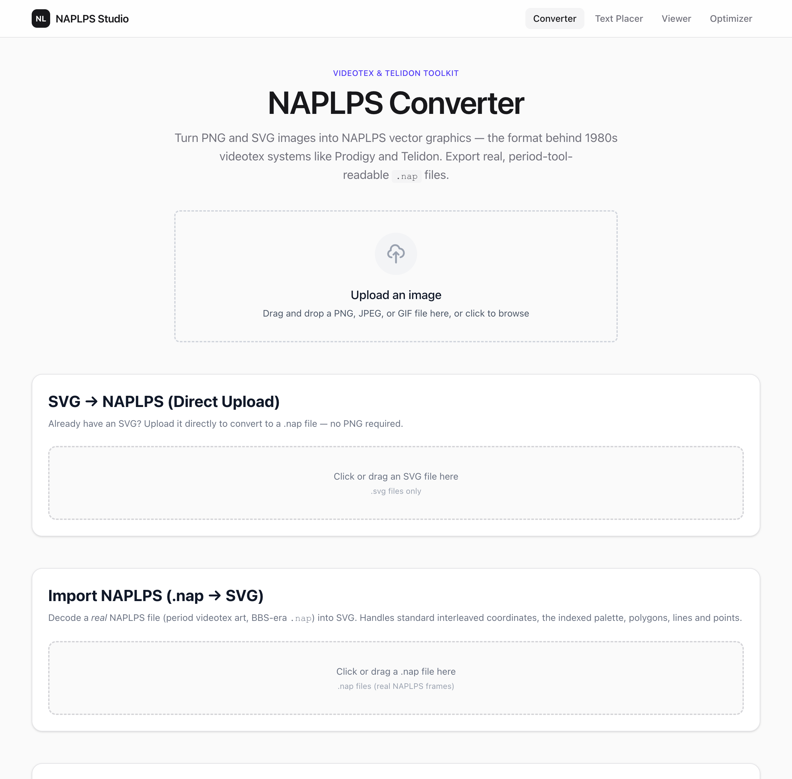
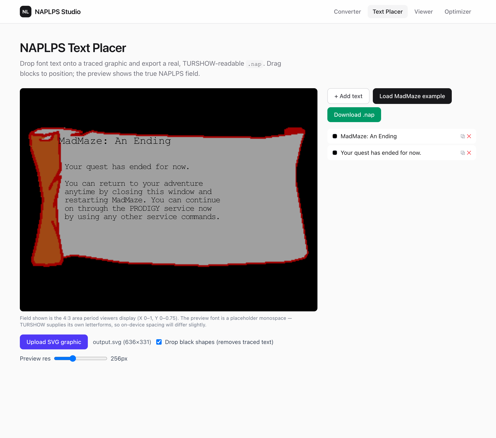
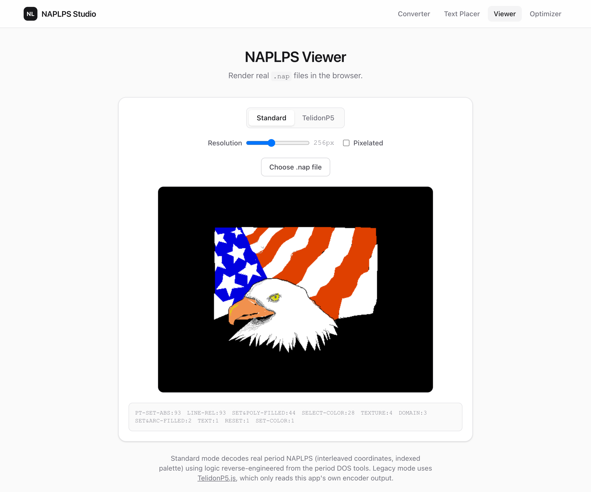
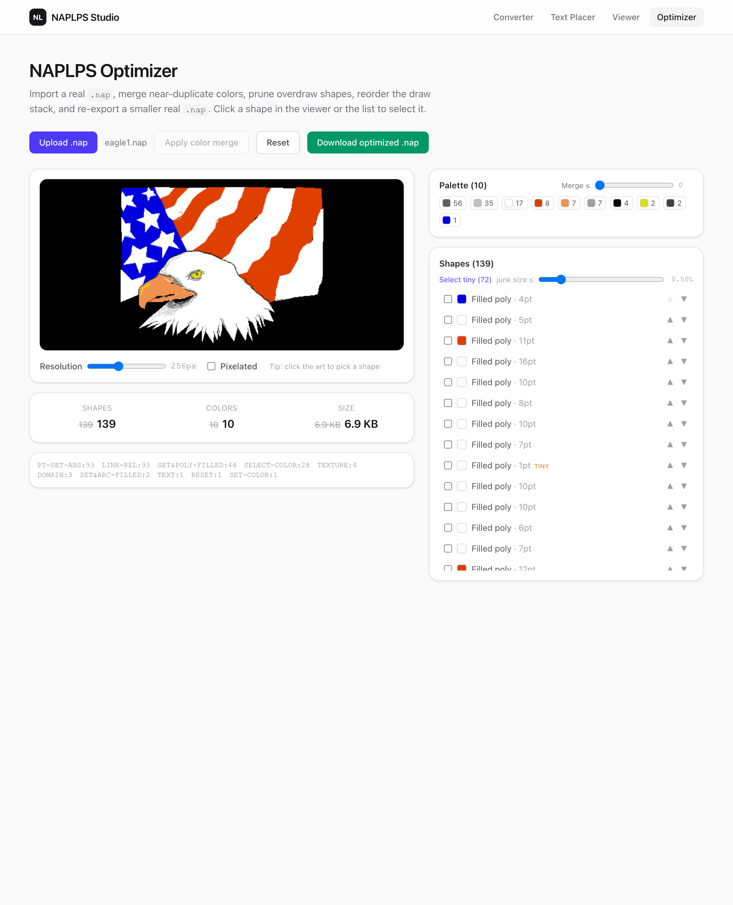

# NAPLPS Converter

A Next.js web application for converting images to **NAPLPS** (North American Presentation Layer Protocol Syntax) — the vector graphics format used by Telidon, Prodigy, and other 1980s videotex systems — and for viewing and editing `.nap` files in the browser.

It can produce **real, period-tool-readable `.nap` files** (verified against the 1993 DOS viewer TurShow) as well as a TelidonP5-compatible dialect for the built-in browser viewer.

---

## Screens

| Converter — PNG/SVG → NAPLPS | Text Placer — font text over a graphic |
| :---: | :---: |
|  |  |
| **Viewer — render real `.nap`** | **Optimizer — clean up &amp; shrink `.nap`** |
|  |  |

---

## Two NAPLPS dialects

This project encodes/decodes NAPLPS in two flavors. Knowing which is which matters:

| Dialect | Files | Reads in | Use it for |
|---|---|---|---|
| **Standard** (real NAPLPS) | `naplps-std-encoder.ts`, `naplps-std-decoder.ts`, `naplpsRaster.ts`, `naplpsToSvg.ts` | Period tools (TurShow), the in-app raster viewer | Authentic `.nap` files: interleaved coordinates, indexed 16-slot palette |
| **TelidonP5 ("foxtoolbox")** | `naplps-foxtoolbox.ts`, `naplps-decoder.ts` | The bundled [TelidonP5.js](https://github.com/groundh0g/TelidonP5.js) viewer | The app's own simplified dialect (separate X/Y bytes, full-RGB `SET COLOR`) |

The **standard** path is the one validated on real 1993 hardware/emulation. The TelidonP5 path predates it and remains for the in-browser TelidonP5 viewer.

---

## Features

- **PNG → SVG → NAPLPS** — Upload a PNG/JPEG/GIF, vectorize it (web-worker median-cut + RLE), then convert to `.nap`
- **SVG → NAPLPS (direct)** — Upload any `.svg` and convert without going through a PNG
- **Standard `.nap` export** — TURSHOW-readable real NAPLPS (interleaved coords + indexed palette)
- **Text Placer** (`/text-placer`) — Drop crisp NAPLPS font text onto a traced graphic, drag to position over a true-field preview, and export a real `.nap`
- **NAPLPS Viewer** (`/naplps-viewer`) — Renders real `.nap` files via a low-res raster (ported from TurShow's model), with the TelidonP5 dialect as a legacy toggle
- **NAPLPS import** (`.nap → SVG`) — Decode a real `.nap` back into editable SVG
- **Optimizer** (`/optimizer`) — Import a real `.nap`, merge near-duplicate colors to the palette, click shapes in the viewer to select/prune overdraw, reorder the draw stack, and re-export a smaller real `.nap` with live before/after stats
- **Download** — Binary `.nap` or hex `.txt`

---

## What is NAPLPS?

NAPLPS (ANSI X3.110-1983 / CSA T500-1983) is a binary graphics protocol developed in the early 1980s for transmitting vector graphics over low-bandwidth links. It was used by:

- **Telidon** — Canada's videotex system, the direct ancestor of NAPLPS
- **Prodigy** — One of the first major US online services (1988–2001)
- **Cable television** — Interactive program guides and info graphics

Key encoding properties:
- Opcode bytes `0x20–0x3F` (bit 6 = 0); data bytes `0x40–0x7F` (bit 6 = 1)
- 12-bit coordinates per axis; real NAPLPS **interleaves** X/Y bits per data byte
- Color via an indexed palette: `SET COLOR (0x3C)` defines slots, `SELECT COLOR (0x3E)` picks one
- Shapes drawn mostly as `SET & POLY FILLED (0x37)`, points/lines, and arcs

---

## Getting Started

### Prerequisites
- Node.js 18+
- npm

### Installation

```bash
git clone https://github.com/Hmmnd0/NAPLPS-Converter.git
cd NAPLPS-Converter
npm install
npm run dev
```

Open [http://localhost:3000](http://localhost:3000).

### Build / test

```bash
npm run build    # production build
npm test         # Vitest suite (encode/decode round-trips, jsdom)
npm run lint     # ESLint
```

---

## Usage

### PNG / SVG → NAPLPS
1. Upload a PNG/JPEG/GIF (or jump to the **SVG → NAPLPS** section and upload an `.svg`)
2. Review/download the intermediate SVG
3. **Convert SVG to NAPLPS** for the TelidonP5 dialect, or **Download standard .nap** for a real, TURSHOW-readable file

### Text Placer (`/text-placer`)
1. Upload the traced SVG graphic
2. Add/position font-text blocks by dragging them over the live field preview; edit text, X/Y, char size, and color
3. **Download .nap** — the graphic plus crisp NAPLPS font text

### NAPLPS Viewer (`/naplps-viewer`)
- Upload any real `.nap` to render it (Standard raster mode), or switch to the TelidonP5 dialect renderer

### NAPLPS import (`.nap → SVG`)
- On the main page, import a `.nap` to decode it back into SVG for editing

---

## Testing against period hardware (TurShow + DOSBox)

The standard `.nap` output is validated against **TurShow v1.05**, a 1993 DOS NAPLPS viewer, running under [DOSBox-X](https://dosbox-x.com/).

> ⚠️ **TurShow is third-party shareware (© 1993 Shawn Rhoads / Software @ Work, all rights reserved) and is _not_ redistributed in this repository.** Obtain your own copy; its license permits a single local copy for personal use only.

With your own `TURSHOW.EXE` placed in a local (git-ignored) folder, the test loop is:

```bash
# copy the file to a space-free mount dir
cp your_output.nap /tmp/turshow/OUTPUT.NAP

# launch TurShow in DOSBox-X (VGA)
pkill -f dosbox-x; sleep 1
dosbox-x -fastlaunch \
  -c "mount c /tmp/turshow" -c "c:" \
  -c "TURSHOW OUTPUT.NAP -vga"
```

`.nap` files are git-ignored by default (`*.nap`), except the real period fixtures under `test-fixtures/nap/` used by the decoder tests.

---

## Project Structure

```
src/
├── app/
│   ├── page.tsx                # Main converter + .nap import
│   ├── text-placer/page.tsx    # Font-text placement UI → real .nap
│   ├── naplps-viewer/page.tsx  # Raster + TelidonP5 viewer
│   ├── optimizer/page.tsx      # Cleanup/optimizer: import .nap, merge colors, prune shapes, re-export
│   └── layout.tsx
├── components/
│   ├── AppHeader.tsx           # Shared top navigation
│   ├── FileUpload.tsx          # Drag-and-drop upload
│   └── SvgAccuracyTest.tsx
└── lib/
    ├── svgToNaplps.ts          # SVG parsing pipeline + svgToNaplpsFoxtoolbox / svgToNaplpsStandard
    ├── naplps-std-encoder.ts   # Standard (real) NAPLPS encoder — interleaved coords, indexed palette, font text
    ├── naplps-std-decoder.ts   # Standard (real) NAPLPS decoder
    ├── naplpsRaster.ts         # Low-res framebuffer renderer (TurShow-style)
    ├── naplpsToSvg.ts          # Real .nap → SVG (auto-fit viewBox)
    ├── naplps-foxtoolbox.ts    # TelidonP5-dialect encoder
    ├── naplps-decoder.ts       # TelidonP5-dialect decoder (round-trip tests)
    ├── naplps.ts               # Shared NAPLPSPoint / NAPLPSColor types
    └── pixelToSvg.ts(.worker)  # PNG → SVG vectorizer (web worker)

public/telidon/                 # p5.min.js, naplps.js, TelidonP5.js (legacy dialect viewer)
docs/                           # NAP.txt spec + naplps-format-findings.md + reference PDFs
test-fixtures/nap/              # Real period .nap files (decoder test fixtures)
```

---

## Technical Notes

### Standard encoder (`naplps-std-encoder.ts`)
- Period header (preamble + SO + RESET + DOMAIN `mvl=3` + TEXTURE) copied from real files
- ≤16-slot indexed palette via `SELECT COLOR` + `SET COLOR` (black → slot 0)
- `SET & POLY FILLED` (first vertex absolute, rest relative); `POINT ABS` / `LINE REL` for degenerate cases
- Coordinates quantized to the LSB with delta chaining → no accumulated drift (round-trip is bit-exact on most fixtures)
- Optional **font text** blocks via `TEXT` / `FIELD` / SI character runs

### Raster renderer (`naplpsRaster.ts`)
- Low-res framebuffer + scanline even-odd fill + Bresenham boundary pixels + a seam-seal pass
- Optional `fieldHeight` mode projects the absolute NAPLPS field (X 0–1, Y 0–fieldHeight) for overlaying field-space content (used by the Text Placer)

---

## Technologies

- **Next.js** (App Router) + **TypeScript** + **Tailwind CSS**
- **p5.js** / **TelidonP5.js** — the legacy in-browser dialect viewer
- **Vitest** + jsdom — encode/decode round-trip tests

---

## References

- ANSI X3.110-1983 / CSA T500-1983 — NAPLPS standard
- [NAP.txt](docs/NAP.txt) — Practical NAPLPS reference (Michael Dillon, 1993)
- [docs/naplps-format-findings.md](docs/naplps-format-findings.md) — real-format notes from decompiling period tools
- [TelidonP5.js](https://github.com/groundh0g/TelidonP5.js) — Browser-based Telidon renderer
- TurShow v1.05 — © 1993 Shawn Rhoads / Software @ Work (third-party shareware; not included)
